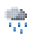

# ActionBar+

&nbsp;**For Minecraft 1.21.8 Fabric**
Shows in-game time and weather above the hotbar
Format:

> &nbsp;12:30 | 

## Build

```bash
git clone https://rich_beluga/actionbar # clone repo
cd actionbar
./gradlew build
```

Result: `build/libs/actionbar-{version}.jar`